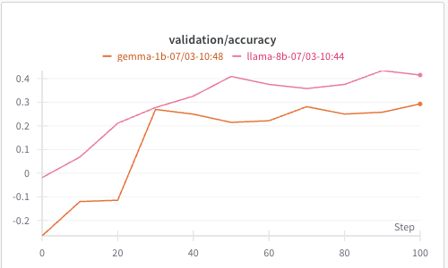

## What I have run so far

- 07/01: successfully run sliding_puzzle example:
```
uv run python examples/run_grpo_sliding_puzzle.py logger.wandb_enabled=True grpo.val_at_start=True policy.train_micro_batch_size=1 cluster.gpus_per_node=8
```

- 07/02: run with new dummy retreival simulator:
Task: env generate and hide a list of integers, LLM agent need to guess how many unique integers are in the list.
Allow LLM to ask for the list of integers by index one by one.

```
uv run python examples/run_grpo_unique_numbers.py
```
or with llama-8b
```
uv run python examples/run_grpo_unique_numbers.py --config examples/configs/grpo_unique_numbers_llama8b.yaml
```

Seems there is some chat render/format issue with gemma-1b, leading to low quality in the beginning. Llama-8b seems to be better?



see full wandb metrics [here](https://wandb.ai/jialeichen777-google/grpo-simulated-retrieval/reports/Dummy-retrival-task-for-llama-8b-and-gemma-1b--VmlldzoxMzQ0OTgyMw)